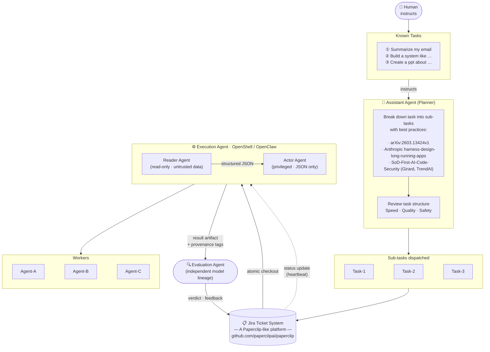

# Finding NEMO — System Specification

> **NEMO**: **N**etwork of **E**xecution and **M**anagement **O**rchestration
> _"How to route a ticket to the right nemo claw"_

---

## 1. Purpose

Finding NEMO is a **SoD-first multi-agent orchestration system** that accepts human instructions, decomposes them into auditable sub-tasks, routes those tasks to the correct specialized execution agent ("claw"), and evaluates outcomes against quality and safety criteria before closure.

The name is intentional: the ocean (the task space) is large and ambiguous. NEMO's job is not to do all the swimming — it is to find the *right claw* in *Nemo's world* to handle each task, then verify the result independently.

---

## 2. Design Principles

These principles are non-negotiable and come directly from the three reference pillars:

| Principle | Source | Implication |
|-----------|--------|-------------|
| **Framework design drives performance** | arXiv:2603.13424v1 — Tsao & Cheng (Trend Micro AI Lab) | Agent selection and framework structure matter as much as model capability. Same LLM in a better framework = 50% performance delta. |
| **Separation of Duties (SoD)** | Girard, TrendAI (March 2026) | The agent that generates output must never be the agent that certifies it. Generator ≠ Reviewer. Execution ≠ Evaluation. |
| **Harness design for long-running tasks** | Anthropic Engineering | Long tasks must be checkpointable, observable, and recoverable. Agents operate via heartbeat loops, not fire-and-forget. |
| **Prompt injection isolation** | OpenClaw / openclaudepromptinjection | Untrusted external data never reaches a privileged actor. A read-only Reader agent sanitizes first; a structured JSON summary is passed to the Actor. |

---

## 3. System Architecture

### 3.1 System Diagram



> **Reading the diagram:**  The Planner decomposes human instructions using three reference best-practices sources, reviews the task plan for speed/quality/safety, then writes Task-1…N into the Paperclip Jira layer.  An Execution Agent (OpenShell/OpenClaw) atomically checks out tasks and routes work through a Reader→Actor pipeline to specialized sub-agents (A/B/C).  An **independent** Evaluation Agent — different model lineage — reviews the output and posts a verdict back to the platform.  The heartbeat loop (dashed) keeps the Execution Agent in sync.

---

### 3.2 Component Detail

```
Human: instruct
  │
  ▼
┌─────────────────────────────────────────────────┐
│           ASSISTANT AGENT (Planner)             │
│  • Breaks task into sub-tasks                   │
│  • Applies best-practice decomposition rules    │
│  • Reviews task structure for speed/quality/    │
│    safety before dispatch                       │
└──────────────────────┬──────────────────────────┘
                       │ structured sub-tasks
                       ▼
┌─────────────────────────────────────────────────┐
│     PAPERCLIP-LIKE TASK PLATFORM (Jira layer)   │
│  • Task-1, Task-2, Task-3, …                    │
│  • Atomic checkout (one agent per task)         │
│  • Budget enforcement, audit log                │
│  • Goal ancestry (every task traces to mission) │
└───────────┬─────────────────────────────────────┘
            │ checkout
            ▼
┌─────────────────────────────────────────────────┐
│        EXECUTION AGENT (OpenShell / OpenClaw)   │
│  ┌──────────────┐   structured JSON             │
│  │ Reader Agent │ ──────────────────────────►   │
│  │ (read-only,  │                               │
│  │ untrusted    │   ◄── raw external content    │
│  │ data only)   │                               │
│  └──────────────┘                               │
│  ┌──────────────┐                               │
│  │ Actor Agent  │ ◄── validated JSON only       │
│  │ (privileged, │                               │
│  │ no raw input)│                               │
│  └──────────────┘                               │
│                                                 │
│  Dispatches to:  Agent-A │ Agent-B │ Agent-C    │
└───────────┬─────────────────────────────────────┘
            │ result
            ▼
┌─────────────────────────────────────────────────┐
│           EVALUATION AGENT (Independent)        │
│  • Different model lineage from Execution agent │
│  • Read-only access to outputs                  │
│  • Structured pass/fail/escalate verdict        │
│  • Posts result back to Paperclip task          │
└─────────────────────────────────────────────────┘
```

---

## 4. Agent Roles and Constraints

### 4.1 Assistant Agent (Planner)

**Responsibility**: Receive human instructions; decompose into concrete, actionable sub-tasks with explicit acceptance criteria.

**Constraints**:
- Must produce structured task objects (title, description, acceptance criteria, estimated agent type, budget ceiling)
- Must apply the decomposition checklist from §6 before dispatch
- Cannot directly execute tasks — it only writes to the task platform
- Must tag each task with `@plannedBy <model-id>` and `@plannedAt <timestamp>`

**Known task types**:
- `summarize` — summarize a document, email thread, or dataset
- `build` — construct a system, feature, or integration
- `create-asset` — produce a deliverable (report, PPT, code module)
- `research` — gather and structure information
- `review` — evaluate an artifact for correctness, quality, or security

### 4.2 Task Platform (Paperclip layer)

**Responsibility**: Persistent, auditable task queue that prevents concurrent work on the same task and enforces budget.

**Core contract** (from Paperclip architecture):
- `POST /tasks/checkout` — atomic lock; only one execution agent wins
- `PATCH /tasks/:id` — update status, append output
- `POST /tasks/:id/subtasks` — create child tasks
- `GET /agents/me` — agent identity and current assignment
- All actions append to immutable `activity_log`

**Invariants**:
- Every task has a `goal_id` linking it to a company/mission goal
- No task may be marked `completed` by the same agent that created its output (SoD gate)
- Budget exhaustion transitions task to `blocked` not `failed`

### 4.3 Execution Agent (OpenShell / OpenClaw)

**Responsibility**: Execute a single checked-out task by orchestrating Reader → Actor → Sub-agents.

**SoD within execution** (prompt injection isolation):

| Sub-role | Access | Input | Output |
|----------|--------|-------|--------|
| **Reader Agent** | Read-only; no tool calls that mutate state | Raw, untrusted external content (files, APIs, web) | Structured JSON summary |
| **Actor Agent** | Privileged; can call tools, write outputs | Validated JSON from Reader only | Task result artifact |

**Sub-agent dispatch**:
- Agent-A, Agent-B, Agent-C are domain-specialized workers (e.g., code, data, comms)
- Selection is deterministic based on `task.type` and `task.tags`
- Routing table is defined in §7

**Constraints**:
- Actor never receives raw external content
- Execution agent cannot approve its own output
- Must tag output with `@executedBy <model-id> <framework-version>` and `@executedAt <timestamp>`

### 4.4 Evaluation Agent (Independent Reviewer)

**Responsibility**: Assess execution output against acceptance criteria, SoD compliance, and security properties.

**Independence requirements** (from Girard SoD paper):
- Must come from a **different model vendor/lineage** than the Execution agent
- Has **read-only** access to task output; cannot mutate any artifact
- Operates in **blind review** mode: does not receive the original planner intent or generator rationale
- Receives only: output artifact, acceptance criteria, deployment context, explicit threat assumptions

**Verdict schema**:
```json
{
  "task_id": "...",
  "verdict": "pass | fail | escalate",
  "confidence": 0.0–1.0,
  "findings": [
    {
      "severity": "critical | high | medium | low | info",
      "claim": "...",
      "exploit_path": "...",
      "preconditions": "...",
      "recommended_fix": "..."
    }
  ],
  "reviewed_by": "<model-id>",
  "reviewed_at": "<ISO-8601>",
  "generator_origin": "<from task tag>"
}
```

**Escalation triggers**:
- `verdict = escalate` → human approval gate opens in Paperclip
- `confidence < 0.6` → always escalate regardless of verdict
- Generator and reviewer model IDs match → SoD violation, hard block

---

## 5. Task Decomposition Rules (Planner Checklist)

Before dispatching any sub-task, the Planner must confirm:

- [ ] Task has a single, unambiguous acceptance criterion
- [ ] Task is assigned to exactly one agent type (`summarize`, `build`, `create-asset`, `research`, `review`)
- [ ] Task has a budget ceiling in token-cents
- [ ] Task has a `goal_id` traceable to the company mission
- [ ] If task touches external data: a Reader sub-step is planned before any Actor step
- [ ] If task produces a code artifact: an independent Evaluation step is in the plan
- [ ] No single agent is planned as both executor and evaluator of the same artifact

---

## 6. Routing Logic — "Finding the Right Claw"

The routing decision maps `(task.type, task.domain, task.risk_level)` → `execution_agent`:

| Task Type | Domain | Risk | Assigned Claw |
|-----------|--------|------|---------------|
| `summarize` | any | low | Agent-A (Reader-only, no Actor needed) |
| `build` | code | medium | Agent-B (OpenClaw with full Reader→Actor pipeline) |
| `build` | infra | high | Agent-B + human approval gate |
| `create-asset` | document/ppt | low | Agent-C |
| `create-asset` | code | medium | Agent-B |
| `research` | any | low | Agent-A |
| `review` | security | high | Evaluation Agent (independent lineage required) |
| `review` | code quality | medium | Evaluation Agent |

**Risk escalation**: any task with external data sources automatically upgrades risk by one level.

---

## 7. Security Model

### 7.1 Prompt Injection Defense

All external content (email bodies, web pages, file contents, API responses) passes through the **Reader Agent** before any action is taken. The Reader produces a sanitized JSON summary. The Actor never sees raw strings from untrusted sources.

This implements the OpenClaw two-agent isolation pattern:
```
[Untrusted External Source] → Reader (read-only) → {structured JSON} → Actor (privileged)
```

### 7.2 SoD Enforcement

Three roles are architecturally separated:

| Role | Model Constraint | Access |
|------|-----------------|--------|
| Generator / Execution Agent | Any approved model | Write to task output, read task definition |
| Security Reviewer / Evaluation Agent | **Different vendor lineage from generator** | Read-only on outputs |
| Approver / Gate | Rules engine + optional human | Block, escalate, log; cannot execute |

Platform-level enforcement:
- Task cannot transition to `completed` unless `evaluation.verdict = pass` from a non-generator agent
- Generator model ID and reviewer model ID are logged and compared at gate; match → hard block
- Audit log is immutable; append-only

### 7.3 Generator-Origin Tagging

All agent outputs carry machine-readable provenance tags:
```
# @generatedBy <model-id>/<version>
# @generationTime <ISO-8601>
# @taskId <task-uuid>
# @reviewedBy <model-id>/<version> <verdict>
```

These tags enable:
- Auditors to reconstruct which model produced each artifact
- Automated detection of same-model generation+review loops
- Drift monitoring when model versions change

---

## 8. Evaluation Framework

The Evaluation Agent tracks per-task metrics that feed into a continuous quality loop:

| Metric | Description |
|--------|-------------|
| `pass_rate_by_task_type` | % of tasks passing first-time evaluation |
| `escalation_rate` | % escalated to human; target < 10% |
| `cross_model_disagreement_rate` | When Tier-1 and Tier-2 reviewers disagree — high correlation with real issues |
| `false_positive_rate` | Findings that close without remediation |
| `sod_violation_count` | Generator = Reviewer events; target = 0 |
| `generator_drift_delta` | Detection pattern change after model version update |

### 8.1 Multi-Tier Review (for high-risk tasks)

High-risk tasks (`risk = high`) invoke a triangulated review:

```
Tier 0: Deterministic baseline (SAST/secrets scan — not LLM-based, cannot be prompt-injected)
Tier 1: Primary LLM Reviewer (different vendor from executor) — finds vulnerabilities
Tier 2: Adversarial LLM Reviewer (different from both executor and Tier-1) — attempts to find what Tier-1 missed
Tier 3: Adjudication gate — merges/deduplicates, scores severity, routes disagreements to human
```

---

## 9. Heartbeat / Long-Running Task Protocol

Execution agents operate on a heartbeat loop (Paperclip pattern):

1. **Checkout** — atomically acquire one pending task
2. **Acknowledge** — post `in_progress` status with agent identity
3. **Execute** — run Reader → Actor → Sub-agent chain
4. **Checkpoint** — write intermediate results; allow recovery on failure
5. **Complete** — post output artifact with provenance tags
6. **Yield** — release lock; Evaluation Agent picks up

Budget exhaustion at any step → transition to `blocked`, not `failed`. Human can increase budget and resume.

---

## 10. Data Model

### Task object
```typescript
interface Task {
  id: string;
  goal_id: string;
  title: string;
  description: string;
  type: "summarize" | "build" | "create-asset" | "research" | "review";
  domain: string;
  risk_level: "low" | "medium" | "high";
  status: "pending" | "in_progress" | "blocked" | "awaiting_review" | "completed" | "failed";
  assigned_agent_id: string | null;
  budget_cents: number;
  spent_cents: number;
  acceptance_criteria: string;
  output_artifact_url: string | null;
  provenance_tags: ProvenanceTags;
  evaluation: EvaluationVerdict | null;
  parent_task_id: string | null;
  created_at: string;
  updated_at: string;
}

interface ProvenanceTags {
  generated_by: string;      // model-id/version
  generated_at: string;      // ISO-8601
  reviewed_by: string | null;
  reviewed_at: string | null;
  verdict: "pass" | "fail" | "escalate" | null;
}
```

---

## 11. Non-Functional Requirements

| Requirement | Target |
|-------------|--------|
| Task checkout atomicity | No two agents may hold the same task simultaneously |
| Audit log immutability | Append-only; no deletes; tamper-evident |
| SoD hard enforcement | Zero tolerance: generator = reviewer → automatic block |
| Escalation latency | Human approval gate notified within 60 seconds of escalation |
| Budget accuracy | Spend tracking to within ±1% of actual token cost |
| Provenance completeness | 100% of completed tasks have `@generatedBy` and `@reviewedBy` tags |

---

## 12. References

1. Tsao, W-K. & Cheng, D. — "Framework Design Over Model Intelligence" (Trend Micro AI Lab) — arXiv:2603.13424v1
2. Anthropic Engineering — "Harness Design for Long-Running Apps" — anthropic.com/engineering/harness-design-long-running-apps
3. Girard, D. — "Separation-of-Duties-First AI Code Security" — TrendAI Security for AI, March 2026
4. Paperclip platform architecture — `/Users/sparkt/2026C/paperclip`
5. OpenClaw prompt injection defense pattern — `tech-study-notes/openclaudepromptinjection`
