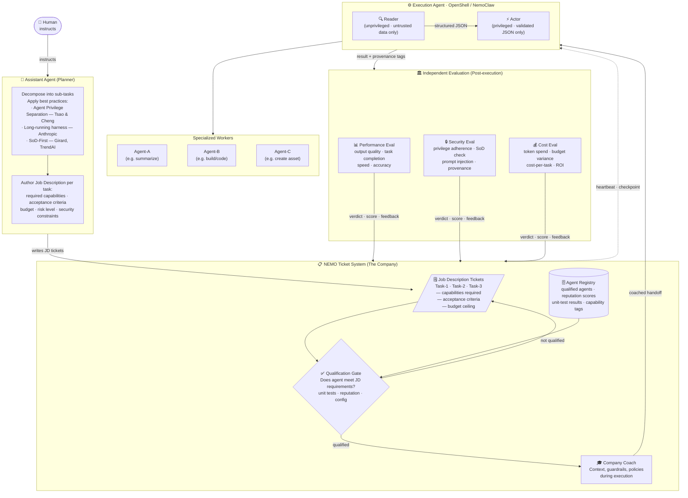

# Finding NEMO
## An Agent Ticket System to Find the Right NemoClaw
### _Make your Agents work together faster, better and safer_

<div align="center">
  
  <br/>
  <sub><strong>NEMO: Network of Execution and Management Orchestration</strong> · Finding NEMO Proposal v1.0 · March 2026</sub>
</div>

---

> **NEMO**: **N**etwork of **E**xecution and **M**anagement **O**rchestration
> _"An agent ticket system that routes every task to the right NemoClaw"_

---

## 1. Purpose

### The Problem

Modern AI workflows are fragmented. A human gives an instruction; a single agent attempts everything; quality, safety, and accountability are afterthoughts. As task complexity grows — spanning code generation, research, document creation, infrastructure automation — no single agent is the right tool for every sub-problem. The result is slower output, correlated failure modes, and no audit trail.

### What Finding NEMO Is

Finding NEMO is a **multi-agent orchestration layer** modeled on how a well-run company hires and manages employees — except the employees are AI agents. The ticket system acts as the **company**: it posts Job Descriptions (JDs), qualifies candidates, coaches workers, enforces security controls, and evaluates performance when the work is done.

The goal is simple: **make your agents work together faster, better, and safer.**

- **Faster** — tasks are parallelized across pre-qualified specialized agents; no single agent context-switches between unrelated domains
- **Better** — the right agent for each job, verified before assignment; agent capability is declared and tested, not assumed
- **Safer** — the company (ticket system) maintains oversight at every stage: it does not merely dispatch and forget

**The three-stage lifecycle:**

| Stage | Company Analogy | What Happens |
|-------|----------------|--------------|
| **Post** | Write a Job Description | Ticket is created with task requirements, required capabilities, acceptance criteria, and budget |
| **Qualify & Assign** | Screen and hire | Agent must prove qualification (unit tests, reputation score, or config match) before checking out the ticket |
| **Coach, Control & Evaluate** | Manage, audit, appraise | System coaches the agent during execution, enforces security controls on inputs/outputs, then runs three independent evaluations on the result: **performance**, **security**, and **cost** |

### Where It Comes From

Finding NEMO synthesizes ideas from multiple layers of research and tooling:

| Layer | Source | Contribution |
|-------|--------|-------------|
| **Orchestration control plane** | [Paperclip](https://github.com/paperclipai/paperclip) | Persistent task queue, atomic checkout, budget enforcement, heartbeat loop, goal ancestry — the "company OS" for agents |
| **Agent privilege separation** | Tsao & Cheng — "Agent Privilege Separation: A Structural Defense Against Prompt Injection" (arXiv:2603.13424v1) | Structural isolation between unprivileged readers and privileged actors prevents prompt injection across any multi-agent system — not limited to OpenClaw; generalizes to any agent runtime |
| **Long-running agent harness** | Anthropic Engineering | Checkpointing, observability, and recovery patterns for agents that run beyond a single context window |
| **Security & independence** | Girard, TrendAI — SoD-First AI Code Security (March 2026) | The generator must never be the reviewer; multi-LLM independence, blind review, provenance tagging |

### Execution Runtime — OpenShell and NemoClaw

The execution layer is built on **OpenShell** and **NemoClaw**, enabling native integration with **NVIDIA's agent ecosystem** (NIM microservices, NeMo Agent Toolkit, CUDA-accelerated inference) — while remaining runtime-agnostic. A NemoClaw is any execution agent registered in the platform; it can run on NVIDIA infrastructure, Claude Code, Codex, Gemini, or any HTTP-compatible agent runtime.

> The name is intentional: in a vast ocean of tasks, NEMO's job is not to do all the swimming — it is to find the *right claw* and hand off with confidence, then verify the catch independently.

---

## 2. Design Principles

These principles are non-negotiable and come directly from the three reference pillars:

| Principle | Source | Implication |
|-----------|--------|-------------|
| **Agent privilege separation** | Tsao & Cheng — arXiv:2603.13424v1 | Structurally separate unprivileged Reader agents (untrusted data, read-only) from privileged Actor agents (validated JSON only, tool access). This pattern is runtime-agnostic — it applies inside OpenClaw, NemoClaw, or any multi-agent execution layer. |
| **Separation of Duties (SoD)** | Girard, TrendAI (March 2026) | The agent that generates output must never be the agent that certifies it. Generator ≠ Reviewer. Execution ≠ Evaluation. |
| **Harness design for long-running tasks** | Anthropic Engineering | Long tasks must be checkpointable, observable, and recoverable. Agents operate via heartbeat loops, not fire-and-forget. |

---

## 3. System Architecture

### 3.1 System Diagram



> **Reading the diagram:** The Planner decomposes instructions into **Job Description tickets** — each specifying required capabilities, acceptance criteria, and budget. The Ticket System (the company) checks the **Agent Registry** to qualify a candidate before any checkout: agents must pass unit tests, meet reputation thresholds, or satisfy config requirements. A **Company Coach** provides context and guardrails during execution. Inside the Execution Agent, **privilege separation** (Tsao & Cheng) keeps untrusted data in an unprivileged Reader and only structured JSON flows to the privileged Actor. On completion, three **independent evaluations** run: performance, security, and cost — each feeding verdicts back to the ticket system to update agent reputation and task status.

---

### 3.2 Component Detail

```
Human: instruct
  │
  ▼
┌─────────────────────────────────────────────────┐
│           ASSISTANT AGENT (Planner)             │
│  • Breaks task into sub-tasks                   │
│  • Applies best-practice decomposition rules    │
│  • Reviews task structure for speed/quality/    │
│    safety before dispatch                       │
└──────────────────────┬──────────────────────────┘
                       │ structured sub-tasks
                       ▼
┌─────────────────────────────────────────────────┐
│     PAPERCLIP-LIKE TASK PLATFORM (Jira layer)   │
│  • Task-1, Task-2, Task-3, …                    │
│  • Atomic checkout (one agent per task)         │
│  • Budget enforcement, audit log                │
│  • Goal ancestry (every task traces to mission) │
└───────────┬─────────────────────────────────────┘
            │ checkout
            ▼
┌─────────────────────────────────────────────────┐
│        EXECUTION AGENT (OpenShell / OpenClaw)   │
│  ┌──────────────┐   structured JSON             │
│  │ Reader Agent │ ──────────────────────────►   │
│  │ (read-only,  │                               │
│  │ untrusted    │   ◄── raw external content    │
│  │ data only)   │                               │
│  └──────────────┘                               │
│  ┌──────────────┐                               │
│  │ Actor Agent  │ ◄── validated JSON only       │
│  │ (privileged, │                               │
│  │ no raw input)│                               │
│  └──────────────┘                               │
│                                                 │
│  Dispatches to:  Agent-A │ Agent-B │ Agent-C    │
└───────────┬─────────────────────────────────────┘
            │ result
            ▼
┌─────────────────────────────────────────────────┐
│           EVALUATION AGENT (Independent)        │
│  • Different model lineage from Execution agent │
│  • Read-only access to outputs                  │
│  • Structured pass/fail/escalate verdict        │
│  • Posts result back to Paperclip task          │
└─────────────────────────────────────────────────┘
```

---

## 4. Agent Roles and Constraints

### 4.1 Assistant Agent (Planner)

**Responsibility**: Receive human instructions; decompose into concrete, actionable sub-tasks with explicit acceptance criteria.

**Constraints**:
- Must produce structured task objects (title, description, acceptance criteria, estimated agent type, budget ceiling)
- Must apply the decomposition checklist from §6 before dispatch
- Cannot directly execute tasks — it only writes to the task platform
- Must tag each task with `@plannedBy <model-id>` and `@plannedAt <timestamp>`

**Known task types**:
- `summarize` — summarize a document, email thread, or dataset
- `build` — construct a system, feature, or integration
- `create-asset` — produce a deliverable (report, PPT, code module)
- `research` — gather and structure information
- `review` — evaluate an artifact for correctness, quality, or security

### 4.2 Task Platform — The Company (Paperclip layer)

**Responsibility**: Act as the company. Post Job Descriptions, qualify agents, coach execution, enforce security controls, and close tasks only after evaluation.

**Job Description (JD) model**: Every ticket is a JD, not just a task description. It must declare:
- `required_capabilities` — what skills/tools the agent must possess (e.g., `code-execution`, `web-search`, `gpu-inference`)
- `qualification_method` — how capability is verified: `unit_test`, `reputation_score`, `config_match`, or `manual`
- `acceptance_criteria` — explicit, testable definition of done
- `security_constraints` — privilege level, allowed external sources, output sanitization rules
- `budget_ceiling` — max token spend in cents
- `coaching_context` — guidance, policies, and guardrails provided to the agent at handoff

**Coaching**: Before handing off to an execution agent, the platform injects `coaching_context` — task-specific policies, domain guidelines, and security rules. The agent is not left to interpret the task cold.

**Security control during execution**: The platform monitors heartbeats and can intervene: pause, redirect, or terminate an agent that exceeds budget, violates privilege constraints, or goes silent.

**Core API contract** (from Paperclip architecture):
- `POST /tasks/checkout` — atomic lock after qualification gate passes; only one qualified agent wins
- `PATCH /tasks/:id` — update status, append output
- `POST /tasks/:id/subtasks` — create child tasks
- `GET /agents/me` — agent identity, assigned task, coaching context
- All actions append to immutable `activity_log`

**Invariants**:
- Every task has a `goal_id` linking it to a company/mission goal
- No agent may check out a task without passing the qualification gate
- No task may be marked `completed` without a passing evaluation verdict (SoD gate)
- Budget exhaustion transitions task to `blocked`, not `failed`

### 4.3 Execution Agent (OpenShell / OpenClaw)

**Responsibility**: Execute a single checked-out task by orchestrating Reader → Actor → Sub-agents.

**SoD within execution** (prompt injection isolation):

| Sub-role | Access | Input | Output |
|----------|--------|-------|--------|
| **Reader Agent** | Read-only; no tool calls that mutate state | Raw, untrusted external content (files, APIs, web) | Structured JSON summary |
| **Actor Agent** | Privileged; can call tools, write outputs | Validated JSON from Reader only | Task result artifact |

**Sub-agent dispatch**:
- Agent-A, Agent-B, Agent-C are domain-specialized workers (e.g., code, data, comms)
- Selection is deterministic based on `task.type` and `task.tags`
- Routing table is defined in §7

**Constraints**:
- Actor never receives raw external content
- Execution agent cannot approve its own output
- Must tag output with `@executedBy <model-id> <framework-version>` and `@executedAt <timestamp>`

### 4.4 Evaluation Agent (Independent Reviewer)

**Responsibility**: Assess execution output against acceptance criteria, SoD compliance, and security properties.

**Independence requirements** (from Girard SoD paper):
- Must come from a **different model vendor/lineage** than the Execution agent
- Has **read-only** access to task output; cannot mutate any artifact
- Operates in **blind review** mode: does not receive the original planner intent or generator rationale
- Receives only: output artifact, acceptance criteria, deployment context, explicit threat assumptions

**Verdict schema**:
```json
{
  "task_id": "...",
  "verdict": "pass | fail | escalate",
  "confidence": 0.0–1.0,
  "findings": [
    {
      "severity": "critical | high | medium | low | info",
      "claim": "...",
      "exploit_path": "...",
      "preconditions": "...",
      "recommended_fix": "..."
    }
  ],
  "reviewed_by": "<model-id>",
  "reviewed_at": "<ISO-8601>",
  "generator_origin": "<from task tag>"
}
```

**Escalation triggers**:
- `verdict = escalate` → human approval gate opens in Paperclip
- `confidence < 0.6` → always escalate regardless of verdict
- Generator and reviewer model IDs match → SoD violation, hard block

---

### 4.5 Agent Registry and Qualification

Every agent that works in the NEMO system must be registered and qualified before it can take tickets. This is the hiring process.

**Registration record**:

| Field | Description |
|-------|-------------|
| `agent_id` | Unique identifier |
| `capabilities` | Declared skill tags (e.g., `code-execution`, `web-search`, `gpu-inference`, `summarization`) |
| `runtime` | Execution environment (OpenShell, NemoClaw, Claude Code, Gemini, HTTP, etc.) |
| `qualification_status` | `pending`, `qualified`, `probation`, `disqualified` |
| `reputation_score` | Rolling score 0.0–1.0 updated after each evaluation |
| `unit_test_results` | Pass/fail records per capability claim |
| `last_evaluated_at` | ISO-8601 timestamp |
| `cost_profile` | Average token spend per task type |

**Qualification methods** (any one is sufficient per capability):

1. **Unit test** — the platform runs a known task with a known correct answer and scores the result
2. **Reputation score** — rolling average of past evaluation verdicts; agents start on probation until score ≥ 0.7
3. **Config match** — declarative check: agent's registered tools/permissions match the JD's `required_capabilities`
4. **Manual** — human explicitly approves the agent for a task class (used for novel or high-risk work)

**Qualification gate logic**:
```
for each required_capability in JD.required_capabilities:
    if agent does not satisfy capability via any qualification method:
        → reject checkout; agent stays in queue
if all capabilities satisfied:
    → grant checkout; inject coaching_context
```

**Reputation update after evaluation**:
- Performance verdict `pass` → +0.05 to reputation
- Performance verdict `fail` → -0.10 to reputation
- Security violation → -0.20 to reputation; triggers review
- Reputation < 0.4 → agent moved to `probation`; requires manual re-qualification

---

## 5. Task Decomposition Rules (Planner Checklist)

Before dispatching any sub-task, the Planner must confirm:

- [ ] Task has a single, unambiguous acceptance criterion
- [ ] Task is assigned to exactly one agent type (`summarize`, `build`, `create-asset`, `research`, `review`)
- [ ] Task has a budget ceiling in token-cents
- [ ] Task has a `goal_id` traceable to the company mission
- [ ] If task touches external data: a Reader sub-step is planned before any Actor step
- [ ] If task produces a code artifact: an independent Evaluation step is in the plan
- [ ] No single agent is planned as both executor and evaluator of the same artifact

---

## 6. Routing Logic — "Finding the Right Claw"

The routing decision maps `(task.type, task.domain, task.risk_level)` → `execution_agent`:

| Task Type | Domain | Risk | Assigned Claw |
|-----------|--------|------|---------------|
| `summarize` | any | low | Agent-A (Reader-only, no Actor needed) |
| `build` | code | medium | Agent-B (OpenClaw with full Reader→Actor pipeline) |
| `build` | infra | high | Agent-B + human approval gate |
| `create-asset` | document/ppt | low | Agent-C |
| `create-asset` | code | medium | Agent-B |
| `research` | any | low | Agent-A |
| `review` | security | high | Evaluation Agent (independent lineage required) |
| `review` | code quality | medium | Evaluation Agent |

**Risk escalation**: any task with external data sources automatically upgrades risk by one level.

---

## 7. Security Model

### 7.1 Agent Privilege Separation

Based on Tsao & Cheng's "Agent Privilege Separation: A Structural Defense Against Prompt Injection" (arXiv:2603.13424v1), this pattern is a **general architectural principle** — not tied to any single runtime. It applies equally inside OpenShell, NemoClaw, Claude Code, or any multi-agent execution layer.

**Core principle**: Every agent that touches external content must be structurally split into two roles with different privilege levels:

```
[Untrusted External Source]
         │
         ▼
  ┌─────────────────┐
  │  Unprivileged   │  Read-only. No tool calls that mutate state.
  │  Reader Agent   │  Sees raw content. Produces structured summary.
  └────────┬────────┘
           │  structured JSON only
           ▼
  ┌─────────────────┐
  │  Privileged     │  Can call tools, write outputs, execute actions.
  │  Actor Agent    │  Never sees raw external content.
  └─────────────────┘
```

**Why this generalizes beyond OpenClaw**:
- Any agent framework where an agent reads from untrusted sources (emails, web, files, APIs, user uploads) and then takes actions is vulnerable to prompt injection
- The structural fix is always the same: separate read from act at the privilege boundary
- In NEMO, this pattern is enforced at the platform level — the coaching context the platform injects explicitly forbids Actors from accepting raw strings; all external content must arrive as validated JSON from a Reader step
- NemoClaw implements this natively; for other runtimes (Claude Code, Gemini, HTTP agents), the platform enforces the boundary via input schema validation before the Actor receives its context

### 7.2 SoD Enforcement

Three roles are architecturally separated:

| Role | Model Constraint | Access |
|------|-----------------|--------|
| Generator / Execution Agent | Any approved model | Write to task output, read task definition |
| Security Reviewer / Evaluation Agent | **Different vendor lineage from generator** | Read-only on outputs |
| Approver / Gate | Rules engine + optional human | Block, escalate, log; cannot execute |

Platform-level enforcement:
- Task cannot transition to `completed` unless `evaluation.verdict = pass` from a non-generator agent
- Generator model ID and reviewer model ID are logged and compared at gate; match → hard block
- Audit log is immutable; append-only

### 7.3 Generator-Origin Tagging

All agent outputs carry machine-readable provenance tags:
```
# @generatedBy <model-id>/<version>
# @generationTime <ISO-8601>
# @taskId <task-uuid>
# @reviewedBy <model-id>/<version> <verdict>
```

These tags enable:
- Auditors to reconstruct which model produced each artifact
- Automated detection of same-model generation+review loops
- Drift monitoring when model versions change

---

## 8. Evaluation Framework

Every completed task is independently evaluated on three pillars before the ticket closes. Evaluation agents must be from a different model lineage than the execution agent (Girard SoD). Verdicts feed back into agent reputation scores in the registry.

---

### 8.1 Performance Evaluation

**Question**: Did the agent do the job correctly and efficiently?

| Metric | Description | Target |
|--------|-------------|--------|
| `task_completion_rate` | Output satisfies all acceptance criteria | 100% |
| `first_pass_rate` | Tasks passing evaluation without rework | > 85% |
| `output_quality_score` | Rubric-based score against acceptance criteria | ≥ 0.8 |
| `latency_vs_baseline` | Time taken vs. established agent baseline | ≤ 1.2× |
| `subtask_success_rate` | % of sub-tasks completed without escalation | > 90% |

---

### 8.2 Security Evaluation

**Question**: Did the agent stay within its privilege boundary and produce safe outputs?

| Check | Description | Failure Action |
|-------|-------------|----------------|
| **Privilege adherence** | Actor never received raw external content | Hard fail; security event logged |
| **SoD compliance** | Execution agent ≠ evaluation agent | Hard block if same lineage |
| **Prompt injection detection** | Scan output for signs of injected instruction leakage | Escalate to human |
| **Provenance completeness** | All outputs tagged `@generatedBy`, `@reviewedBy` | Fail if missing |
| **Coaching compliance** | Agent respected injected constraints | Log violation; reputation penalty |
| **Output sanitization** | No credential, PII, or secret leakage in artifact | Hard fail |

For high-risk tasks, a multi-tier review applies:
```
Tier 0: Deterministic scan (secrets, SAST, dangerous API usage — not LLM-based)
Tier 1: Independent LLM reviewer (different vendor from executor)
Tier 2: Adversarial LLM reviewer (different from both executor and Tier-1)
Tier 3: Adjudication gate — deduplicates findings, routes disagreements to human
```

---

### 8.3 Cost Evaluation

**Question**: Was the agent economically efficient? Is this agent worth rehiring?

| Metric | Description | Target |
|--------|-------------|--------|
| `spend_vs_budget` | Actual token spend vs. declared budget ceiling | ≤ 100% |
| `cost_per_task_type` | Average spend by task category | Tracked; used for future budgeting |
| `budget_variance` | Deviation from estimate; high variance → inaccurate self-reporting | < ±20% |
| `cost_efficiency_ratio` | Output quality score / token spend | Tracked per agent for comparison |
| `roi_estimate` | Value of output vs. cost (human-evaluated for strategic tasks) | Qualitative |

Cost evaluation results update the agent's `cost_profile` in the registry and inform future JD budget ceilings.

---

### 8.4 Aggregate Verdict and Reputation Update

All three pillar scores are combined into a single task verdict:

```
verdict = "pass"      if performance ≥ 0.8 AND security = clean AND spend ≤ budget
verdict = "fail"      if performance < 0.6 OR any security hard-fail
verdict = "escalate"  otherwise (human reviews before close)
```

The verdict feeds directly into the Agent Registry (§4.5) to update reputation score, cost profile, and qualification status.

---

## 9. Heartbeat / Long-Running Task Protocol

Execution agents operate on a heartbeat loop (Paperclip pattern):

1. **Checkout** — atomically acquire one pending task
2. **Acknowledge** — post `in_progress` status with agent identity
3. **Execute** — run Reader → Actor → Sub-agent chain
4. **Checkpoint** — write intermediate results; allow recovery on failure
5. **Complete** — post output artifact with provenance tags
6. **Yield** — release lock; Evaluation Agent picks up

Budget exhaustion at any step → transition to `blocked`, not `failed`. Human can increase budget and resume.

---

## 10. Data Model

### Task object
```typescript
interface Task {
  id: string;
  goal_id: string;
  title: string;
  description: string;
  type: "summarize" | "build" | "create-asset" | "research" | "review";
  domain: string;
  risk_level: "low" | "medium" | "high";
  status: "pending" | "in_progress" | "blocked" | "awaiting_review" | "completed" | "failed";
  assigned_agent_id: string | null;
  budget_cents: number;
  spent_cents: number;
  acceptance_criteria: string;
  output_artifact_url: string | null;
  provenance_tags: ProvenanceTags;
  evaluation: EvaluationVerdict | null;
  parent_task_id: string | null;
  created_at: string;
  updated_at: string;
}

interface ProvenanceTags {
  generated_by: string;      // model-id/version
  generated_at: string;      // ISO-8601
  reviewed_by: string | null;
  reviewed_at: string | null;
  verdict: "pass" | "fail" | "escalate" | null;
}
```

---

## 11. Non-Functional Requirements

| Requirement | Target |
|-------------|--------|
| Task checkout atomicity | No two agents may hold the same task simultaneously |
| Audit log immutability | Append-only; no deletes; tamper-evident |
| SoD hard enforcement | Zero tolerance: generator = reviewer → automatic block |
| Escalation latency | Human approval gate notified within 60 seconds of escalation |
| Budget accuracy | Spend tracking to within ±1% of actual token cost |
| Provenance completeness | 100% of completed tasks have `@generatedBy` and `@reviewedBy` tags |

---

## 12. References

1. Tsao, W-K. & Cheng, D. — "Agent Privilege Separation in OpenClaw: A Structural Defense Against Prompt Injection" — arXiv:2603.13424v1
2. Anthropic Engineering — "Harness Design for Long-Running Apps" — anthropic.com/engineering/harness-design-long-running-apps
3. Girard, D. — "Separation-of-Duties-First AI Code Security" — TrendAI Security for AI, March 2026
4. Paperclip — Multi-agent orchestration control plane — github.com/paperclipai/paperclip
