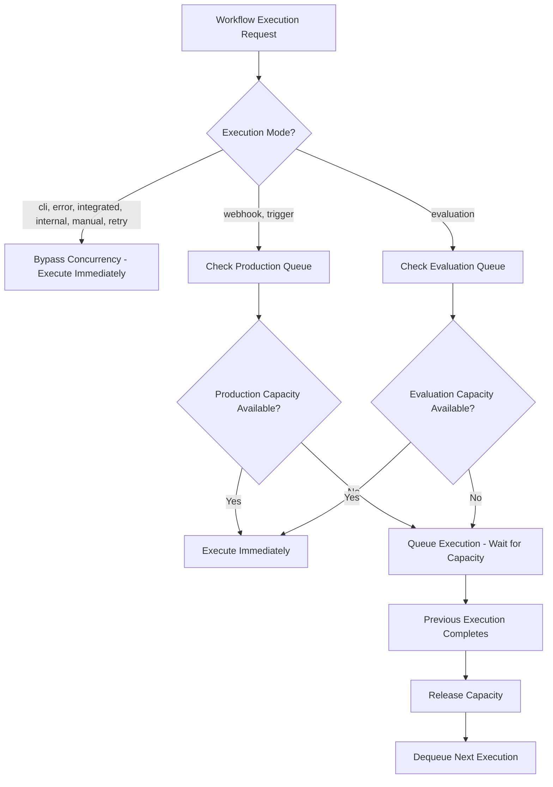
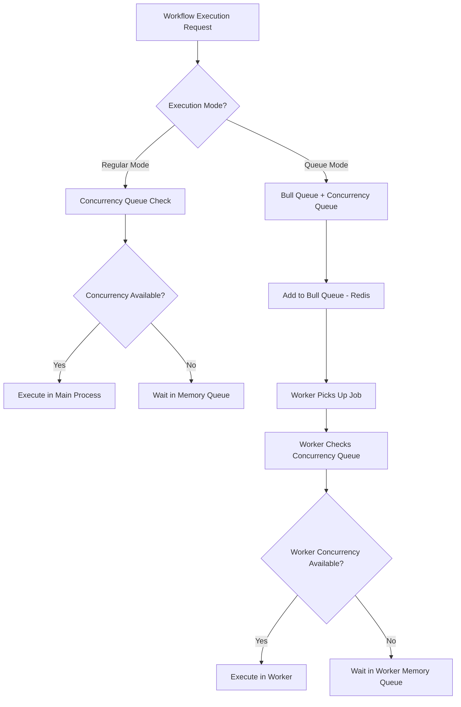

# STUDY 5: Concurrent Workflow Execution in n8n Open Source

## Executive Summary

The open source community version of n8n has **NO DEFAULT LIMIT** on concurrent workflow executions, making it more generous than the paid version which limits users to 5 concurrent executions. The concurrency system is fully configurable and designed for resource management rather than artificial licensing restrictions.

## 1. Concurrent Workflow Execution Limits

### Open Source vs Paid Comparison

| Version | Default Concurrent Executions | Configurable |
|---------|------------------------------|--------------|
| **Open Source Community** | **Unlimited (-1)** | ✅ Yes |
| **Paid ($20/month)** | **5** | Unknown |

### Key Configuration Parameters

```typescript
// Default values in packages/cli/src/config/schema.ts
executions: {
  concurrency: {
    productionLimit: {
      default: -1,  // -1 = UNLIMITED
      env: 'N8N_CONCURRENCY_PRODUCTION_LIMIT',
    },
    evaluationLimit: {
      default: -1,  // -1 = UNLIMITED  
      env: 'N8N_CONCURRENCY_EVALUATION_LIMIT',
    },
  },
}
```

### Cloud Deployment Notes

- There's a `CLOUD_TEMP_PRODUCTION_LIMIT = 999` constant used for telemetry tracking
- This appears to be for cloud deployment monitoring, not a hard limit for self-hosted instances

## 2. Understanding "Concurrent Workflow Execution"

### Scope of Concurrency

**Concurrent execution means N executions across ALL workflows, not per individual workflow template.**

The system operates with two separate concurrency queues:

#### Production Queue
- Handles real workflow executions
- Applies to execution modes: `webhook`, `trigger`
- Controlled by `N8N_CONCURRENCY_PRODUCTION_LIMIT`

#### Evaluation Queue  
- Handles testing/preview executions
- Applies to execution mode: `evaluation`
- Controlled by `N8N_CONCURRENCY_EVALUATION_LIMIT`

### Execution Modes and Concurrency

```typescript
// Modes that BYPASS concurrency limits (unlimited):
- 'cli'        // Command line executions
- 'error'      // Error workflow executions  
- 'integrated' // Integrated executions
- 'internal'   // Internal system executions
- 'manual'     // Manual test executions
- 'retry'      // Retry executions

// Modes that RESPECT concurrency limits:
- 'webhook'    // → Production queue
- 'trigger'    // → Production queue  
- 'evaluation' // → Evaluation queue
```

## 3. Technical Implementation

### Architecture Overview

The concurrency system is implemented in TypeScript/JavaScript (not Python) using:

- **Service**: `ConcurrencyControlService` - Main orchestration
- **Queue**: `ConcurrencyQueue` - FIFO queue with capacity management
- **Configuration**: Environment variables and config schema
- **Events**: Telemetry and throttling events

### Core Components

```typescript
// packages/cli/src/concurrency/concurrency-control.service.ts
export class ConcurrencyControlService {
  private readonly limits: Map<ConcurrencyQueueType, number>;
  private readonly queues: Map<ConcurrencyQueueType, ConcurrencyQueue>;
  
  // Key methods:
  async throttle({ mode, executionId })  // Queue execution if needed
  release({ mode })                      // Release capacity
  remove({ mode, executionId })          // Remove from queue
}
```

### Queue Behavior

```typescript
// packages/cli/src/concurrency/concurrency-queue.ts
export class ConcurrencyQueue {
  async enqueue(executionId: string) {
    this.capacity--;
    if (this.capacity < 0) {
      // Execution is queued, not rejected
      return new Promise<void>((resolve) => 
        this.queue.push({ executionId, resolve })
      );
    }
  }
}
```

## 4. Configuration Options

### Environment Variables

```bash
# Production executions (webhook, trigger modes)
N8N_CONCURRENCY_PRODUCTION_LIMIT=-1    # Default: unlimited

# Evaluation executions (testing mode)  
N8N_CONCURRENCY_EVALUATION_LIMIT=-1    # Default: unlimited
```

### Valid Configuration Values

| Value | Behavior |
|-------|----------|
| `-1` | **Unlimited** (default) |
| `> 0` | **Limited** to specified number |
| `0` | **Invalid** - throws error |
| `< -1` | **Treated as unlimited** |

### Worker Mode Configuration

```typescript
// packages/cli/src/commands/worker.ts
static flags = {
  concurrency: Flags.integer({
    default: 10,  // Default worker concurrency
    description: 'How many jobs can run in parallel.',
  }),
};

// Environment variable overrides flag:
this.concurrency = envConcurrency !== -1 ? envConcurrency : flags.concurrency;
```

## 5. Execution Flow Analysis

### When Concurrency Control Applies



### What Happens When Limits Are Reached

**IMPORTANT: Executions are QUEUED, not DROPPED when limits are reached.**

#### Example Scenario: Limit Set to 10

```bash
N8N_CONCURRENCY_PRODUCTION_LIMIT=10
```

**Timeline of Events:**

1. **Requests 1-10**: Execute immediately (capacity available)
2. **Request 11**: Gets **QUEUED** (not dropped), waits for capacity
3. **Request 12**: Gets **QUEUED** behind request 11
4. **Request 13+**: Continue queuing in FIFO order

**When Execution #3 completes (after 100 seconds):**
- Capacity increases from 0 to 1
- Request 11 is **automatically dequeued** and starts executing
- Queue now has requests 12, 13, 14... waiting

#### Code Implementation

```typescript
// packages/cli/src/concurrency/concurrency-queue.ts
async enqueue(executionId: string) {
  this.capacity--;  // Reduce available capacity
  
  if (this.capacity < 0) {
    // QUEUE the execution (don't drop it)
    this.emit('execution-throttled', { executionId });
    
    return new Promise<void>((resolve) => 
      this.queue.push({ executionId, resolve })
    );
  }
  // If capacity >= 0, execution proceeds immediately
}
```

### Queue Management

- **FIFO**: First In, First Out execution order
- **Non-blocking**: Executions are queued, not rejected or dropped
- **Capacity tracking**: Real-time monitoring of available slots
- **Event-driven**: Telemetry and monitoring events
- **Promise-based**: Queued executions wait on promises that resolve when capacity becomes available

### Understanding "Concurrent" in Workflow Context

**"Concurrent workflow execution" means multiple COMPLETE workflow runs happening simultaneously.**

#### What Constitutes One "Concurrent Execution"

Each workflow execution (from trigger to completion) counts as ONE concurrent execution:

```
Workflow A: Trigger → Node 1 → Node 2 → Node 3 → Complete (100 seconds total)
Workflow B: Trigger → Node 1 → Node 2 → Complete (50 seconds total)
Workflow C: Trigger → Node 1 → Complete (10 seconds total)
```

If limit = 2:
- **Time 0s**: Workflow A starts, Workflow B starts (2/2 slots used)
- **Time 5s**: Workflow C gets **QUEUED** (waits for A or B to finish)
- **Time 50s**: Workflow B completes → Workflow C **automatically starts**
- **Time 100s**: Workflow A completes → Next queued workflow can start

#### Long-Running Workflows Impact

**Yes, the queue waits for long-running workflows to complete.**

**Example with 100-second workflow:**

```bash
# Limit set to 3 concurrent executions
N8N_CONCURRENCY_PRODUCTION_LIMIT=3

Timeline:
00:00 - Workflow 1 starts (webhook trigger) - will run for 100 seconds
00:05 - Workflow 2 starts (webhook trigger) - will run for 30 seconds  
00:10 - Workflow 3 starts (webhook trigger) - will run for 20 seconds
00:15 - Workflow 4 QUEUED (waits for any of 1,2,3 to finish)
00:20 - Workflow 5 QUEUED (waits behind Workflow 4)

00:30 - Workflow 3 completes → Workflow 4 starts immediately
00:35 - Workflow 2 completes → Workflow 5 starts immediately
01:40 - Workflow 1 completes (after 100 seconds)
```

**Key Points:**
- Each workflow holds its slot for the **entire duration** of execution
- Long-running workflows (100+ seconds) will block new executions if limit is reached
- The system does **NOT** interrupt or time-out long-running workflows
- Queued workflows wait patiently until capacity becomes available

#### Within-Workflow Concurrency

**Important distinction**: The concurrency limit applies to **complete workflow executions**, not individual nodes within a workflow.

```
Single Workflow Execution = 1 Concurrent Slot
├── Node 1 (HTTP Request) - 5 seconds
├── Node 2 (Data Processing) - 2 seconds  
├── Node 3 (Database Write) - 3 seconds
└── Node 4 (Email Send) - 1 second
Total: 11 seconds = 1 concurrent execution slot
```

Even if Node 1 makes 10 parallel HTTP requests internally, this still counts as **1 concurrent workflow execution**.

## 6. Queue Ownership and Storage

### Two Different Queue Systems

**IMPORTANT: n8n uses TWO separate queue systems that serve different purposes:**

#### 1. Concurrency Queue (In-Memory)
- **Owner**: n8n process itself
- **Storage**: **In-memory only** (JavaScript arrays)
- **Purpose**: Controls how many workflows can run simultaneously
- **Persistence**: **NOT persistent** - lost on restart
- **Location**: `packages/cli/src/concurrency/concurrency-queue.ts`

```typescript
// This is a simple in-memory JavaScript array
private readonly queue: Array<{
  executionId: string;
  resolve: () => void;
}> = [];
```

#### 2. Bull Job Queue (Redis-based)
- **Owner**: External Redis server
- **Storage**: **Redis database** (persistent)
- **Purpose**: Manages job distribution in scaling/worker mode
- **Persistence**: **Persistent** - survives restarts
- **Location**: `packages/cli/src/scaling/scaling.service.ts`

```typescript
// This uses Bull.js with Redis backend
const { default: BullQueue } = await import('bull');
this.queue = new BullQueue(QUEUE_NAME, {
  prefix,
  settings: this.globalConfig.queue.bull.settings,
  createClient: (type) => service.createClient({ type: `${type}(bull)` }),
});
```

### Queue System Relationship



### Storage Characteristics

| Aspect | Concurrency Queue | Bull Job Queue |
|--------|------------------|----------------|
| **Storage** | In-memory JavaScript Array | Redis Database |
| **Persistence** | ❌ Lost on restart | ✅ Survives restarts |
| **Shared** | ❌ Per-process only | ✅ Shared across workers |
| **Purpose** | Rate limiting | Job distribution |
| **External Dependency** | ❌ None | ✅ Requires Redis |

### What Happens on Restart

#### Concurrency Queue (In-Memory)
```bash
# Before restart: 3 executions queued
Concurrency Queue: [exec-123, exec-456, exec-789]

# After restart: Queue is empty
Concurrency Queue: []
# Queued executions are LOST
```

#### Bull Job Queue (Redis)
```bash
# Before restart: 3 jobs queued in Redis
Bull Queue (Redis): [job-123, job-456, job-789]

# After restart: Jobs still exist in Redis
Bull Queue (Redis): [job-123, job-456, job-789]
# Jobs are PRESERVED and will be processed
```

### Configuration Dependencies

#### Regular Mode (Single Instance)
```bash
# Only needs concurrency configuration
N8N_CONCURRENCY_PRODUCTION_LIMIT=10

# No Redis required - uses in-memory queue only
```

#### Queue Mode (Scaling/Workers)
```bash
# Needs both concurrency AND Redis configuration
N8N_CONCURRENCY_PRODUCTION_LIMIT=10

# Redis configuration for Bull queue
QUEUE_BULL_REDIS_HOST=localhost
QUEUE_BULL_REDIS_PORT=6379
QUEUE_BULL_REDIS_DB=0
```

### Memory vs Persistent Queue Behavior

#### In-Memory Concurrency Queue
- **Fast**: No network calls, immediate response
- **Volatile**: Lost on process restart/crash
- **Process-specific**: Each n8n instance has its own queue
- **Simple**: Just JavaScript arrays and promises

#### Redis Bull Queue  
- **Persistent**: Survives restarts and crashes
- **Shared**: Multiple workers can access the same queue
- **Network-dependent**: Requires Redis connection
- **Feature-rich**: Job priorities, retries, scheduling, monitoring

### Practical Implications

#### For Self-Hosted Users

**Single Instance (Regular Mode):**
- Concurrency queue is **in-memory only**
- If n8n restarts, queued executions are **lost**
- No external dependencies required

**Multi-Instance (Queue Mode):**
- Bull queue is **persistent in Redis**
- Concurrency queue is still **in-memory per worker**
- Jobs survive restarts, but concurrency queuing doesn't

#### Example Scenario

```bash
# Setup: Limit = 2, Queue Mode with Redis
N8N_CONCURRENCY_PRODUCTION_LIMIT=2

Timeline:
1. 3 webhook requests arrive simultaneously
2. Request 1,2: Start executing (concurrency slots used)
3. Request 3: Added to Bull queue (Redis) AND concurrency queue (memory)
4. n8n worker restarts
5. Request 3: Still in Bull queue (Redis) ✅
6. Request 3: Lost from concurrency queue (memory) ❌
7. Worker picks up Request 3 from Bull queue
8. Request 3: Checks concurrency → executes immediately (slots available)
```

## 7. Monitoring and Telemetry

### Cloud Deployment Tracking

```typescript
// Telemetry thresholds for cloud deployments
export const CLOUD_TEMP_REPORTABLE_THRESHOLDS = [5, 10, 20, 50, 100, 200];

// Tracks when users approach limits
this.telemetry.track('User hit concurrency limit', {
  threshold: CLOUD_TEMP_PRODUCTION_LIMIT - capacity,
  concurrencyQueue: type,
});
```

### Events Emitted

- `execution-throttled`: When execution is queued due to capacity
- `execution-released`: When execution completes and releases capacity
- `concurrency-check`: Periodic capacity monitoring

## 8. Resource Exhaustion Risk with Default Settings

### ⚠️ CRITICAL WARNING: Default Unlimited Setting Risk

**YES, the default limit=-1 means n8n will accept and run ALL incoming requests simultaneously without any throttling.**

#### What This Means in Practice

```bash
# Default configuration (DANGEROUS for production)
N8N_CONCURRENCY_PRODUCTION_LIMIT=-1  # UNLIMITED

# Scenario: 1000 webhook requests arrive simultaneously
# Result: n8n attempts to run ALL 1000 workflows at once
```

#### Resource Exhaustion Timeline

```
Time 0s:   100 webhook requests arrive → All start executing
Time 1s:   200 more requests arrive → All start executing  
Time 2s:   500 more requests arrive → All start executing
Time 3s:   System runs out of memory → n8n crashes
Time 4s:   Docker container restarts → All queued executions LOST
```

#### Real-World Impact

**Memory Consumption:**
- Each workflow execution consumes 10-50MB+ of RAM
- 100 concurrent workflows = 1-5GB RAM usage
- 1000 concurrent workflows = 10-50GB RAM usage
- **Result: Out of Memory (OOM) crash**

**CPU Consumption:**
- Each workflow uses CPU cycles for processing
- No limit = CPU usage can hit 100% across all cores
- **Result: System becomes unresponsive**

**Network Consumption:**
- HTTP requests, API calls, database connections
- No limit = can exhaust network connections
- **Result: Connection pool exhaustion**

#### Docker Container Behavior

```bash
# Docker container with default settings
docker run -it --rm \
  --name n8n \
  -p 5678:5678 \
  n8nio/n8n

# What happens with traffic spike:
1. Container receives 500+ simultaneous webhooks
2. Starts 500+ workflow executions simultaneously  
3. RAM usage spikes to 10GB+ (exceeds container limits)
4. Docker kills container due to OOM
5. Container restarts with empty concurrency queue
6. All in-progress executions are LOST
```

### Why n8n Defaults to Unlimited

The unlimited default exists because:

1. **Development/Testing**: Easy to get started without configuration
2. **Small Deployments**: Many users have low traffic volumes
3. **Flexibility**: Allows users to set their own limits based on hardware
4. **No Assumptions**: n8n doesn't know your server specifications

**However, this is NOT suitable for production environments with significant traffic.**

## 9. Practical Implications

### For Self-Hosted Users

1. **⚠️ MUST configure limits for production** - The default unlimited setting can crash your system
2. **Resource-based scaling** - Set limits based on your actual CPU, memory, and I/O capacity  
3. **Monitor and adjust** - Start conservative and increase based on monitoring

### Recommended Settings by Hardware

#### AWS Instance Type Recommendations

| Instance Type | vCPU | RAM | Recommended Limit | Use Case |
|---------------|------|-----|------------------|----------|
| **t2.nano** | 1 | 0.5GB | **1-2** | ⚠️ **NOT RECOMMENDED** |
| **t2.micro** | 1 | 1GB | **2-3** | Development/Testing only |
| **t2.small** | 1 | 2GB | **3-5** | Light development |
| **t2.medium** | 2 | 4GB | **5-10** | Small production |
| **t2.large** | 2 | 8GB | **10-15** | Medium production |
| **t3.medium** | 2 | 4GB | **8-12** | Better performance |
| **t3.large** | 2 | 8GB | **15-20** | Recommended minimum |
| **t3.xlarge** | 4 | 16GB | **25-35** | Production workloads |
| **c5.large** | 2 | 4GB | **20-25** | CPU-optimized |
| **c5.xlarge** | 4 | 8GB | **35-50** | High-performance |

#### ⚠️ t2.nano Specific Warning

```bash
# AWS t2.nano specifications:
# - 1 vCPU (burstable)
# - 0.5GB RAM (512MB)
# - Network: Low to Moderate

# CRITICAL LIMITATIONS:
N8N_CONCURRENCY_PRODUCTION_LIMIT=1  # MAXIMUM recommended
# Even with limit=1, you may experience:
# - Out of memory crashes with complex workflows
# - CPU throttling due to burst credit exhaustion
# - Network timeouts under load
```

#### t2.nano Configuration Example

```bash
# Docker run command for t2.nano
docker run -d \
  --name n8n \
  --restart unless-stopped \
  -p 5678:5678 \
  -e N8N_CONCURRENCY_PRODUCTION_LIMIT=1 \
  -e N8N_CONCURRENCY_EVALUATION_LIMIT=1 \
  --memory=400m \
  --memory-swap=400m \
  n8nio/n8n

# Additional memory protection
# Limit Docker container to 400MB (leave 100MB for system)
```

#### Why t2.nano is Problematic

**Memory Constraints:**
- n8n base process: ~100-150MB
- Each workflow execution: 10-50MB+
- With 512MB total RAM, you can only run 1-2 simple workflows
- Complex workflows (with large data processing) will cause OOM

**CPU Burst Credits:**
- t2.nano uses CPU burst credits
- Sustained high CPU usage exhausts credits
- Performance drops to baseline (5% of vCPU)
- Workflows become extremely slow

**Network Limitations:**
- Low network performance
- May timeout on external API calls
- Webhook responses may be delayed

#### Better Alternatives for Budget Deployments

```bash
# Minimum recommended for production
Instance: t3.medium (2 vCPU, 4GB RAM)
Configuration: N8N_CONCURRENCY_PRODUCTION_LIMIT=8
Cost: ~$30/month

# Budget option with acceptable performance  
Instance: t2.medium (2 vCPU, 4GB RAM)
Configuration: N8N_CONCURRENCY_PRODUCTION_LIMIT=5
Cost: ~$24/month

# If you must use t2.nano (development only)
Instance: t2.nano (1 vCPU, 0.5GB RAM)
Configuration: N8N_CONCURRENCY_PRODUCTION_LIMIT=1
Cost: ~$4/month
Warning: Expect frequent crashes and poor performance
```

### General Hardware-Based Settings

```bash
# For small deployments (1-2 CPU cores, 2-4GB RAM)
N8N_CONCURRENCY_PRODUCTION_LIMIT=5

# For medium deployments (4-8 CPU cores, 8-16GB RAM)  
N8N_CONCURRENCY_PRODUCTION_LIMIT=20

# For large deployments (8+ CPU cores, 16GB+ RAM)
N8N_CONCURRENCY_PRODUCTION_LIMIT=50

# For unlimited (default - use with caution)
N8N_CONCURRENCY_PRODUCTION_LIMIT=-1
```

### Worker Mode Considerations

```bash
# Worker concurrency warning threshold
if (this.concurrency < 5) {
  this.logger.warn(
    'Concurrency is set to less than 5. THIS CAN LEAD TO AN UNSTABLE ENVIRONMENT.'
  );
}
```

## 8. Comparison with Other Systems

| System | Open Source Limit | Paid Limit | Configurable |
|--------|------------------|------------|--------------|
| **n8n** | **Unlimited** | 5 | ✅ Yes |
| Zapier | N/A | 20-100+ | ❌ No |
| Make.com | N/A | 10-40+ | ❌ No |
| Integromat | N/A | Variable | ❌ No |

## 9. Key Takeaways

1. **Open source n8n is MORE generous** than the paid cloud version for concurrent executions
2. **Fully configurable** - no artificial restrictions for self-hosted deployments  
3. **Smart architecture** - different execution types have appropriate concurrency controls
4. **Resource-focused** - designed for performance optimization, not monetization limits
5. **Production-ready** - includes proper queuing, monitoring, and telemetry systems

## 10. Configuration Examples

### Unlimited Concurrency (Default)
```bash
# .env file
N8N_CONCURRENCY_PRODUCTION_LIMIT=-1
N8N_CONCURRENCY_EVALUATION_LIMIT=-1
```

### Conservative Resource Management
```bash
# .env file  
N8N_CONCURRENCY_PRODUCTION_LIMIT=10
N8N_CONCURRENCY_EVALUATION_LIMIT=5
```

### High-Performance Setup
```bash
# .env file
N8N_CONCURRENCY_PRODUCTION_LIMIT=100
N8N_CONCURRENCY_EVALUATION_LIMIT=20
```

---

**Conclusion**: The open source version of n8n provides unlimited concurrent workflow execution by default, making it significantly more capable than the paid version's 5-execution limit. This demonstrates n8n's commitment to providing powerful automation capabilities in their open source offering, with concurrency controls designed for resource management rather than artificial limitations.
