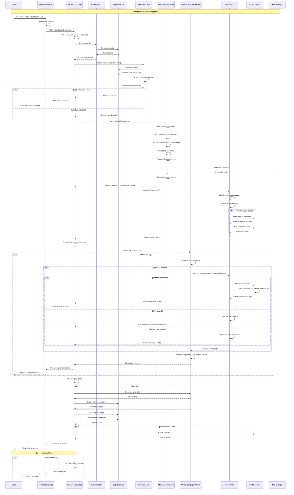

# Study 002: PentestGPT System Architecture & Sequence Diagram

## System Overview

PentestGPT is a sophisticated AI-powered penetration testing platform with a multi-layered architecture that orchestrates external AI models, sandboxed execution environments, and specialized security tools.

## High-Level Architecture

```
┌─────────────────┐    ┌─────────────────┐    ┌─────────────────┐
│   Frontend      │    │   Backend       │    │   External      │
│   (Next.js)     │    │   (Next.js API) │    │   Services      │
├─────────────────┤    ├─────────────────┤    ├─────────────────┤
│ • React UI      │    │ • Chat API      │    │ • OpenAI GPT-4  │
│ • Chat Interface│◄──►│ • Auth Layer    │◄──►│ • xAI Grok-3    │
│ • File Upload   │    │ • Rate Limiting │    │ • Web Search    │
│ • Tool Controls │    │ • Tool Handler  │    │ • E2B Sandbox   │
└─────────────────┘    └─────────────────┘    └─────────────────┘
                                ▲
                                │
                       ┌─────────────────┐
                       │   Database      │
                       │   (Supabase)    │
                       ├─────────────────┤
                       │ • User Data     │
                       │ • Chat History  │
                       │ • File Storage  │
                       │ • Rate Limits   │
                       └─────────────────┘
```

## Detailed Sequence Diagram: User Question Processing



## Component Details

### 1. Frontend Layer (Next.js React)
**Location**: `app/`, `components/`
- **Chat Interface**: Real-time message display with streaming
- **File Upload**: Drag-and-drop file attachments
- **Tool Selection**: Plugin dropdown (Terminal, Web Search, Browser, etc.)
- **Authentication**: Supabase Auth integration

### 2. API Layer (Next.js API Routes)
**Location**: `app/api/chat/route.ts`
- **Request Validation**: Zod schema validation
- **Rate Limiting**: Premium vs free tier limits
- **Stream Management**: Real-time response streaming
- **Error Handling**: Comprehensive error responses

### 3. Authentication & Authorization
**Location**: `lib/server/server-chat-helpers.ts`
- **User Profiles**: Supabase Auth integration
- **Chat Ownership**: Validate user access to chats
- **Premium Features**: Feature gating based on subscription

### 4. Message Processing Pipeline
**Location**: `lib/ai/message-utils.ts`
```typescript
processChatMessages() {
  1. filterEmptyAssistantMessages()
  2. processMessagesWithImagesUnified()
  3. getModerationResult() & addAuthMessage()
  4. validateMessageTokens()
  5. processMessageContentWithAttachments()
  6. getSystemPrompt()
}
```

### 5. AI Provider Integration
**Location**: `lib/ai/providers.ts`
```typescript
myProvider = customProvider({
  'chat-model-small': openai.responses('gpt-4.1-mini-2025-04-14'),
  'chat-model-large': openai.responses('gpt-4.1-2025-04-14'),
  'chat-model-reasoning': xai('grok-3-mini-latest'),
})
```

### 6. Tool System Architecture
**Location**: `lib/ai/tools/toolSchemas.ts`

#### Available Tools:
- **Terminal Tool** (`run_terminal_cmd-tool.ts`): Execute commands in E2B sandbox
- **Web Search** (`web-search.ts`): Real-time web search with citations
- **Browser Tool** (`browser.ts`): Automated web browsing
- **Image Generation** (`image-gen.ts`): AI image generation
- **File Retrieval** (`get_terminal_files-tool.ts`): Access sandbox files

#### Tool Context:
```typescript
interface ToolContext {
  dataStream: any;
  sandbox: Sandbox | null;
  userID: string;
  sandboxManager: SandboxManager;
  selectedPlugin: PluginID;
}
```

### 7. Sandbox Environment (E2B)
**Location**: `lib/ai/tools/agent/`
- **OS**: Debian GNU/Linux 12 (linux/amd64)
- **User**: root with sudo privileges
- **Pre-installed Tools**: nmap, gobuster, subfinder, SecLists, curl, wget
- **Development**: Python 3.12, Node.js 20, Go 1.24
- **Security**: Isolated environment with internet access

### 8. Database Layer (Supabase/Convex)
**Location**: `convex/`

#### Core Tables:
- **chats**: Chat metadata and ownership
- **messages**: Individual chat messages
- **files**: File attachments and metadata
- **profiles**: User profiles and preferences
- **subscriptions**: Premium subscription data

## Data Flow Patterns

### 1. Standard Chat Flow
```
User Input → Validation → Message Processing → AI Provider → Response Stream
```

### 2. Tool-Enhanced Flow
```
User Input → Validation → Message Processing → AI Provider → Tool Execution → Sandbox → Response Stream
```

### 3. File Upload Flow
```
File Upload → Storage → Processing → Sandbox Upload → Tool Access → Analysis
```

## Security Architecture

### 1. Authentication
- **Supabase Auth**: JWT-based authentication
- **Row Level Security**: Database-level access control
- **Service Role Keys**: Backend service authentication

### 2. Authorization
- **Chat Ownership**: Users can only access their own chats
- **Premium Features**: Feature gating based on subscription
- **Rate Limiting**: Per-user request limits

### 3. Sandbox Security
- **Isolated Environment**: E2B provides isolated execution
- **No VPN Access**: TUN/TAP devices not available
- **Temporary Storage**: Sandbox data is ephemeral

### 4. Content Moderation
- **Input Validation**: Zod schema validation
- **Content Filtering**: Moderation checks for inappropriate content
- **Authorization Context**: Automatic pentest authorization injection

## Performance Optimizations

### 1. Streaming
- **Real-time Response**: Streaming text generation
- **Progressive Tool Output**: Live terminal command output
- **Chunked Processing**: Word-level streaming for better UX

### 2. Caching
- **Static Prompts**: Cached prompt prefixes for better performance
- **Model Responses**: Provider-level response caching
- **File Processing**: Cached file analysis results

### 3. Resource Management
- **Sandbox Lifecycle**: Automatic pause/resume of sandboxes
- **Connection Pooling**: Database connection optimization
- **Rate Limiting**: Prevents resource exhaustion

## Error Handling Strategy

### 1. Client-Side Errors
- **Validation Errors**: Real-time form validation
- **Network Errors**: Retry mechanisms and fallbacks
- **Stream Interruption**: Graceful handling of connection loss

### 2. Server-Side Errors
- **API Errors**: Structured error responses
- **Tool Failures**: Fallback mechanisms and error reporting
- **Database Errors**: Transaction rollback and recovery

### 3. External Service Errors
- **AI Provider Failures**: Model fallbacks and retry logic
- **Sandbox Errors**: Error isolation and recovery
- **Storage Failures**: Redundancy and backup mechanisms

## Scalability Considerations

### 1. Horizontal Scaling
- **Stateless API**: Enables horizontal scaling
- **Database Sharding**: User-based data partitioning
- **CDN Integration**: Static asset distribution

### 2. Resource Optimization
- **Sandbox Pooling**: Reuse of sandbox instances
- **Connection Management**: Efficient database connections
- **Memory Management**: Streaming to reduce memory usage

### 3. Cost Management
- **Usage-based Billing**: Pay-per-use AI model costs
- **Resource Limits**: Per-user resource quotas
- **Efficient Caching**: Reduce external API calls

---

## Key Architectural Decisions

1. **External Models**: Uses OpenAI/xAI instead of fine-tuning for faster iteration
2. **Streaming Architecture**: Real-time response for better UX
3. **Tool-based Approach**: Modular tools instead of monolithic agent
4. **Sandbox Isolation**: E2B for secure command execution
5. **Database Choice**: Supabase for rapid development and scaling

---

*Study completed: January 17, 2025*
